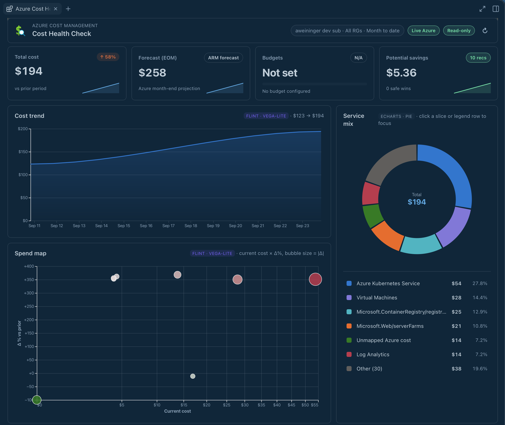

# Azure Cost Health Check

See Azure spend, forecasts, budgets, anomalies, Advisor recommendations, and
AI billing together in a read-only Copilot dashboard.



## Install

The `microsoft/azure-dev-tools` production marketplace contains this reviewed
0.4.4 candidate, but its immutable 0.4.4 tag is not published yet.

If your GitHub Copilot host shows the **awesome-copilot** marketplace, open
**Customize → Plugins** and install **Azure Cost Health Check**. The
[listed 0.4.3 package](https://github.com/microsoft/azure-dev-tools/tree/59e5889e464b099344a8ba8ff13cdf73d401d433/canvases/azure-cost-health-check)
is not this source candidate. The full plugin includes
its canvas and launcher skill. If the marketplace is missing, add it first:

```sh
copilot plugin marketplace add github/awesome-copilot
copilot plugin install azure-cost-health-check@awesome-copilot
```

Reopen Copilot and start a new chat. You need Azure CLI 2.61+ signed in with
read access to the subscriptions and billing data you want to see.
For a published immutable version or canvas-only alternative, see
[installation notes](docs/implementation.md#install).

## Try it

Ask **Open Azure Cost Health Check in real mode for my subscription**.
Confirm the subscription in the canvas, then review spend and cost drivers,
forecasts, native alerts, and AI billing. A loading or permission-limited
section is not zero cost; remediation suggestions do not authorize writes.

## What you can do

- Compare current spend with forecasts and budgets in one read-only dashboard.
- Spot anomalies, alerts, and Advisor recommendations that need attention.
- Review AI billing alongside other cost drivers without treating missing data as zero.

## Prompts to try

> Open Azure Cost Health Check in real mode for my subscription.

> Open Azure Cost Health Check so I can review budget alerts and forecasted spend for my subscription.

For source builds, data coverage, and security behavior, see
[implementation notes](docs/implementation.md).
