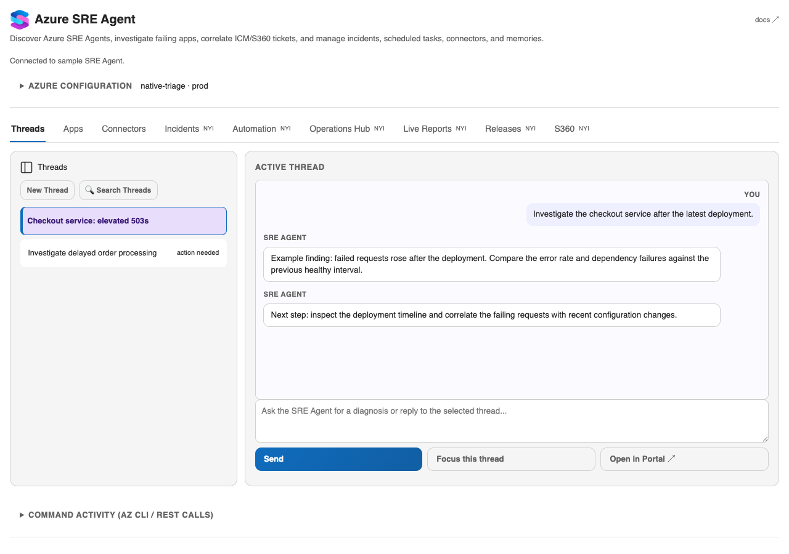

# Azure SRE Agent

Diagnose a failing Azure app with an existing SRE Agent, inspect the resulting
investigation, and continue from its active thread.



*Illustrative fixture data in the actual GitHub Copilot canvas layout.*

## Install

When **Azure SRE Agent** appears in the Microsoft production marketplace,
open GitHub Copilot **Customize → Plugins**, add **microsoft/azure-dev-tools**
(ID `azure-dev-tools`), and install **Azure SRE Agent** with its
`azure-sre-agent-canvas` routing skill:

```sh
copilot plugin marketplace add microsoft/azure-dev-tools
copilot plugin install azure-sre-agent@azure-dev-tools
```

Reopen Copilot and start a fresh chat. You need Azure CLI signed in and
access to an existing Azure SRE Agent. For a
published version pin or canvas-only fallback, see
[installation alternatives](docs/advanced.md).

## Try it

Ask **Open SRE Agent Canvas**. Under **Azure Configuration**, choose the
subscription containing your SRE Agent, select the agent, then select **Apps**,
pick a failing app, and choose **Diagnose with SRE Agent**. If someone shared
an external SRE Agent instead, paste its `sre.azure.com` share link or Azure
resource ID into **Open an agent by URL or resource ID** and choose
**Connect to agent**. Once connected, choose **Save connected agent** to add it
to **Favorites** for quick reconnection across chats. Inspect evidence in
**Threads** and **Active thread**; focus a thread to continue in chat.
Mutating operations require a separate explicit action or host confirmation.

## What you can do

- Find an existing SRE Agent and the apps it monitors.
- Diagnose a failing app and review investigation threads with their evidence.
- Focus an active thread to continue the investigation in chat.

## Prompts to try

> Open SRE Agent Canvas and show me my SRE Agents.

> Open SRE Agent Canvas so I can choose a failing app and diagnose it with my SRE Agent.

> My app is failing. Open SRE Agent Canvas so I can investigate it.

> Investigate checkout-api app with my SRE Agent.

> Open this SRE Agent external share link and help me connect: https://sre.azure.com/externalagents/example?agentUrl=...
